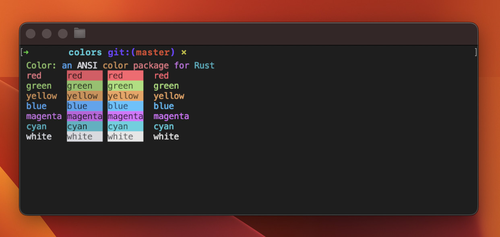

# Colors
[](https://travis-ci.org/stevencyb/rcolors)
[](https://docs.rs/subprocess)

Color lets you use styled outputs in terms of [ANSI Escape
Codes](http://en.wikipedia.org/wiki/ANSI_escape_code#Colors) in Rust. 



## Usage
### Using Macros
The following colors are supported by macros: `black`, `red`, `green`, `yellow`, `blue`, `magenta`, `cyan` and `white`.
```rust
use rcolors::*;

fn main() {
    // like `print` but with color suffix
    print_red!("This is red print! ");
    
    // like `println` but with color suffix
    println_red!("This is red println!");

    // like `format`
    let x = red!("This is a value");
    println!("{}", x);
}
```
### Using Builder
The builder makes it easier to build complex colored text sections.
Unlike the macros, the builder also offers style ANSI codes.
E.g.:
```rust
fn main() {
    Builder::new()
        .bold().fg_yellow().text("Language: ").reset()
        .fg_cyan().italic().text("Rust\n").reset()
        .bold().fg_yellow().text("Username: ").reset()
        .fg_cyan().italic().text("root\n").reset()
        .bold().fg_yellow().text("Password: ").reset()
        .fg_cyan().italic().text("********\n")
        // .print();
        // .println();
        .to_string();
}
```